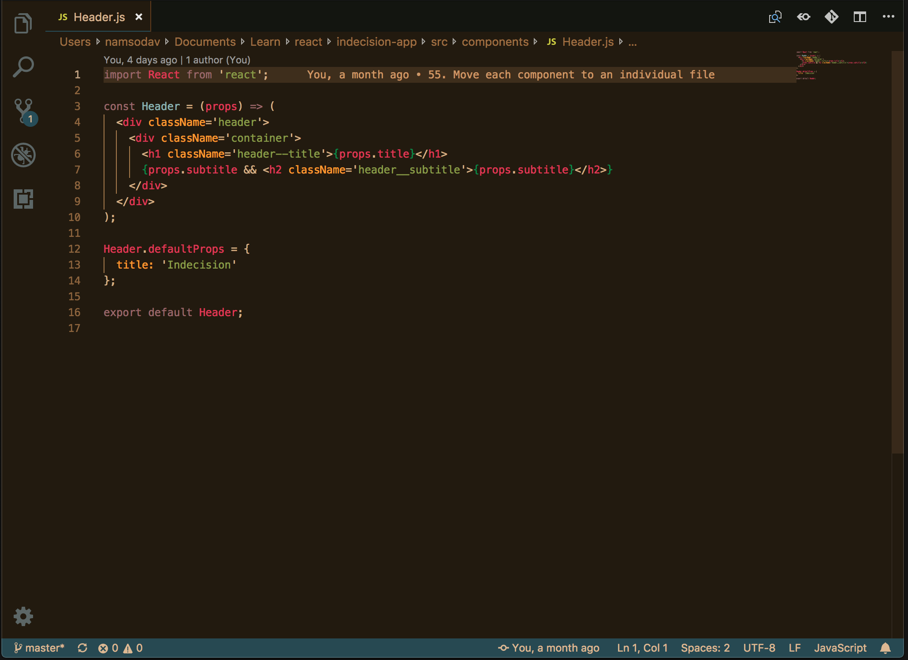

# Kimbie Dark+

A color scheme inspired by [Cold Spring Fault Less Youth](http://www.discogs.com/Mount-Kimbie-Cold-Spring-Fault-Less-Youth/master/561611), originally created by [Jan T. Sott](https://github.com/idleberg/Kimbie.tmTheme), modified by [Dāvis Namsons](https://github.com/dnamsons).

## Color Reference

### Syntax Colors

| Color                                                       | Usage                                                         |
| :---------------------------------------------------------: | ------------------------------------------------------------- |
|  `#98676A` | Keywords, template literals, CSS pseudo classes and constants |
|  `#DC3958` | Variables, tags                                 |
|  `#8AB1B0` | Functions, CSS #ids, markup headings                          |
|  `#F79A32` | Constants, attributes, units, markup links                                  |
|  `#889B4A` | Strings, pseudo CSS, inherited classes                        |
|  `#088649` | Embedded punctuation (e.g. `${}` or `{}` )                    |
|  `#F06431` | Classes, CSS classes                                          |
|  `#7E602C` | Regex, escape characters, support functions                   |
|  `#D3AF86` | Property names, simple text                                   |

### Terminal Colors

| Color               | Normal                                                      | Bright                                                      |
| :-----------------: | :---------------------------------------------------------: | :---------------------------------------------------------: |
| Blue                |  `#719190` |  `#8AB1B0` |
| Cyan                |  `#418292` |  `#4C96A8` |
| Green               |  `#889B4A` |  `#A3B95A` |
| Magenta             |  `#7E5053` |  `#98676A` |
| Red                 |  `#DC3958` |  `#F14A68` |
| Yellow              |  `#F79A32` |  `#FCAC51` |
| Foreground(Default) |  `#C2A383` |                                                             |

## License

This work is licensed under a [Creative Commons Attribution-ShareAlike 4.0 Unported License](http://creativecommons.org/licenses/by-sa/4.0/deed.en_US).
